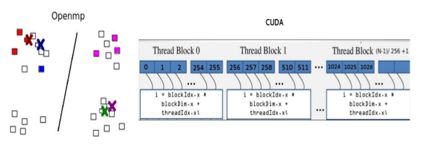
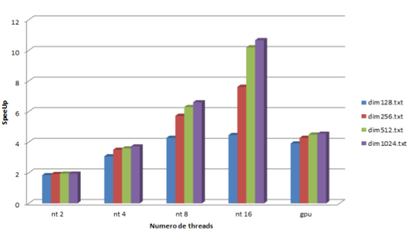

# Parallel K-means
Parallelization of K-Means Clustering Algorithm

Dataset for clustering, http://cs.joensuu.fi/sipu/datasets

Input

- total number of points
- number of dimensions for each point
- number of clusters (K)
- number of threads used
- feature vector for each point

Output

- An array with the cluster to which each point belongs

  

Parallel k-mean algorithm

Speedup table

